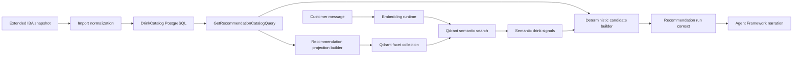

## Context

`Recommendation` already performs deterministic candidate preparation outside the model and already has an explicit embedding runtime seam, but that seam is not implemented and the runtime still depends on exact or substring-oriented matching for most request interpretation.

The current `iba-cocktails-snapshot` preset is also sourced from a preserved upstream-derived file that does not contain descriptions, so the catalog cannot yet provide good semantic retrieval text for mood, flavor, or style requests.

This change introduces semantic retrieval without changing the canonical source-of-truth model:
PostgreSQL remains canonical for drinks and ingredients, while `Recommendation` owns a derived vector projection in Qdrant.

## Goals / Non-Goals

**Goals:**

- Keep the raw upstream IBA snapshot intact and add a separate AlCopilot-owned extended snapshot with curated descriptions.
- Make the default `iba-cocktails-snapshot` preset import descriptions from the extended preserved snapshot.
- Use Qdrant as the vector store for recommendation semantic retrieval.
- Support natural-language descriptive requests using embeddings over curated drink descriptions.
- Support light drink-name and ingredient-name typo tolerance through catalog-backed fuzzy lookup rather than embeddings.
- Keep deterministic exclusions, make-now or buy-next grouping, and persistence outside model-owned execution.

**Non-Goals:**

- Replace PostgreSQL as the canonical catalog store.
- Move recommendation policy into Qdrant or Agent Framework workflows.
- Introduce GraphRAG, Neo4j, LoRA, or QLoRA in this change.
- Add open-ended model-owned write tools.

## Decisions

### 1. The raw upstream snapshot stays untouched and the curated snapshot becomes a separate preserved artifact

The existing preserved file derived from `rasmusab/iba-cocktails` remains unchanged.

This change introduces a second preserved file that is explicitly AlCopilot-owned and curated.

The new file should use a name that makes the relationship clear, such as `iba-cocktails-web.extended.snapshot.json`.

The extended snapshot will:

- preserve the upstream list-of-cocktails shape
- add `description` as an optional top-level property per cocktail
- remain the default no-payload preset source for `iba-cocktails-snapshot`
- keep provenance metadata explicit that the source is an AlCopilot-extended derivative of the upstream dataset rather than the raw upstream file itself

Why this over editing the raw snapshot in place:
it preserves auditability, makes future refreshes easier, and keeps external source material distinct from project-owned curation.

### 2. Description population is phase 0 for semantic retrieval

The team wants complete coverage for the current preset catalog rather than a partial pilot subset.

This change therefore treats description population for every currently preserved IBA cocktail as required seed curation before embedding rollout.

The importer will normalize and persist descriptions from the extended snapshot into the existing `Drink.Description` field.

Why this over deferring description population:
descriptions are the main carrier for requests such as "sparkly sweet", "refreshing citrusy", or "bitter classic", so omitting them would force a second retrieval redesign immediately after the first rollout.

### 3. Recommendation owns a derived Qdrant projection, not a vector-first domain model

`Recommendation` will create and query a Qdrant collection derived from contracts-facing catalog reads.

The collection is projection storage only.

It does not replace canonical drink storage, and it does not become a cross-module source of truth.

Projection rebuild input comes from `GetRecommendationCatalogQuery`.

Why this over placing vector storage inside `DrinkCatalog`:
ADR 0006 and ADR 0012 already established that semantic retrieval belongs in `Recommendation` as a derived projection layered on top of canonical catalog data.

### 4. The first retrieval shape uses one point per described drink instead of multi-vector point schemas

For v1, the Qdrant collection should store one semantic point for each drink that has a curated description:

- `facet = description`

Each point will include:

- a stable point ID
- the owning `DrinkId`
- the facet kind (`description`)
- the curated description text
- small supporting payload such as drink name and category

The query path will embed the customer message once, search the collection, then aggregate hits back to unique drinks with simple facet weighting.

Description hits are the only semantic retrieval signal and should be weighted conservatively so they improve descriptive ranking without becoming policy.

Why this over Qdrant named vectors or one giant per-drink blob:
description points are easier to understand, easier to tune, and keep semantic retrieval focused on the text field where embeddings provide the most value.
Drink and ingredient entity resolution remains in exact and fuzzy catalog lookup, where typo tolerance is more predictable than embedding similarity.

### 5. Semantic retrieval enriches deterministic recommendation inputs instead of replacing them

The recommendation request path will:

1. load the current profile snapshot and recommendation catalog
2. create a query embedding from the customer message
3. retrieve top semantic hits from Qdrant
4. aggregate those hits into semantic signals per drink
5. pass those signals into deterministic candidate preparation for descriptive ranking hints
6. keep hard exclusions and final grouping in normal module code

This means semantic retrieval may improve ranking and flavor-style matching for descriptive prompts, while exact and fuzzy catalog lookup handles drink-name and ingredient-name entity detection. Prohibited ingredients and availability rules still win.

Why this over vector-first candidate selection:
the catalog is still small, so correctness and explicit policy are more important than reducing deterministic evaluation scope.

### 6. Narration reads semantic outcomes through run context rather than direct vector-store tools

The run context will include a compact semantic summary when retrieval materially influenced the result.

That summary may include:

- top matched descriptors from descriptions
- the highest-confidence drink matches

The narrator agent will consume those deterministic semantic hints through the run context rather than querying Qdrant directly as a model tool in v1.

Why this over exposing semantic search as a model tool immediately:
it keeps the retrieval path deterministic and easier to evaluate before adding another tool surface.

## Affected Domain Model

### Drinks Catalog

- Aggregate root remains `Drink`.
- Existing field `Drink.Description` becomes populated by the preserved extended snapshot path.
- No new aggregate roots, value objects, or domain events are required for this change.

### Recommendation

- Aggregate root remains `ChatSession`.
- Semantic retrieval data is derived runtime and projection data, not aggregate state.
- No new domain events are required for the first semantic retrieval slice.

## Data Flow

## Testing Strategy

- Add unit tests for extended snapshot normalization, including description import and provenance metadata.
- Add unit tests for semantic hit aggregation and weighting across description hits.
- Add unit tests for descriptive ranking and run-context hints when the prompt uses descriptive language, plus fuzzy lookup tests for light drink-name and ingredient-name typos.
- Add recommendation application tests that prove hard exclusions still override semantic hits.
- Add integration coverage for projection rebuild and Qdrant-backed retrieval behind a real or disposable test instance where practical.
- Keep existing evaluation-style corpus tests and extend them with semantic prompts such as "sparkly sweet", "refreshing citrus", and typo variants.

## Risks / Trade-offs

- [Curated text quality] -> Writing all descriptions now adds upfront effort, but it avoids weak embeddings and repeated rework.
- [Projection freshness] -> The collection must be rebuilt when catalog content changes, so the first slice should include an explicit rebuild path and import-triggered refresh.
- [Operational complexity] -> Qdrant adds another local service, but that complexity is intentional learning value and aligns with the accepted direction.
- [Over-weighting semantic matches] -> Retrieval weighting must stay conservative so semantic hints help ranking without bypassing deterministic safety.

## Migration Plan

1. Add the preserved extended snapshot and update importer normalization plus provenance metadata.
2. Re-import or refresh the catalog so drink descriptions are populated in PostgreSQL.
3. Add Qdrant integration and a recommendation projection builder that emits description points for drinks with curated descriptions.
4. Implement semantic retrieval plus deterministic aggregation into recommendation run inputs.
5. Extend recommendation evaluation and integration tests with semantic-language cases and fuzzy typo-tolerance cases.
6. Update architecture, operations, and local AI guidance docs.

Rollback strategy:

- No relational schema change is required for the documentation-approved baseline of this change.
- Rollback can disable semantic retrieval and revert to substring matching while leaving canonical catalog data intact.
- If a later implementation adds projection bookkeeping tables or migration-backed configuration, that work must document a separate down-migration path before apply.
